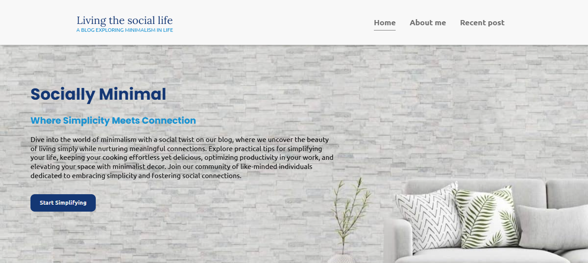

# Living the Social Life

A blog exploring minimalism in life, featuring articles, recent posts, and tips for simple living.

## Project Structure

- `index.html` — Main landing page with carousel and navigation.
- `about-me.html` — About the author and their journey to minimalism.
- `recent.html` — List of recent blog posts.
- `recentPost.html`, `recentPost1.html`, `recentPost2.html`, `recentPost3.html`, `recentPost4.html` — Individual blog post pages.
- `style.css`, `indexStyle.css` — Stylesheets for layout and design.
- `script.js` — JavaScript for navigation, loading animations, and "read more" toggles.
- `img/` — Images used throughout the site.
- `README.md` — Project overview (this file).

## Features

- Responsive navigation bar and sidebar.
- Loading animations for pages and widgets.
- "Read more" functionality for articles.
- Minimalist design with custom fonts and icons.
- Newsletter subscription form in the footer.

## Getting Started

Visit [livingthesociallife.com](https://living-the-social-ife.vercel.app/) to view the site online.

## License

This project is for educational and personal use.

## Preview

Below is a screenshot of the homepage, showcasing the minimalist design and layout of "Living the Social Life":

